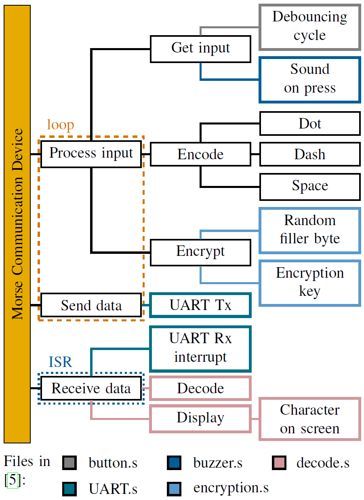
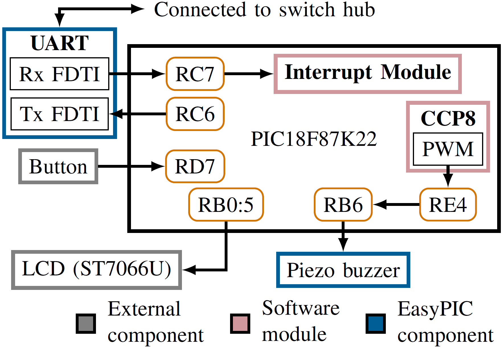
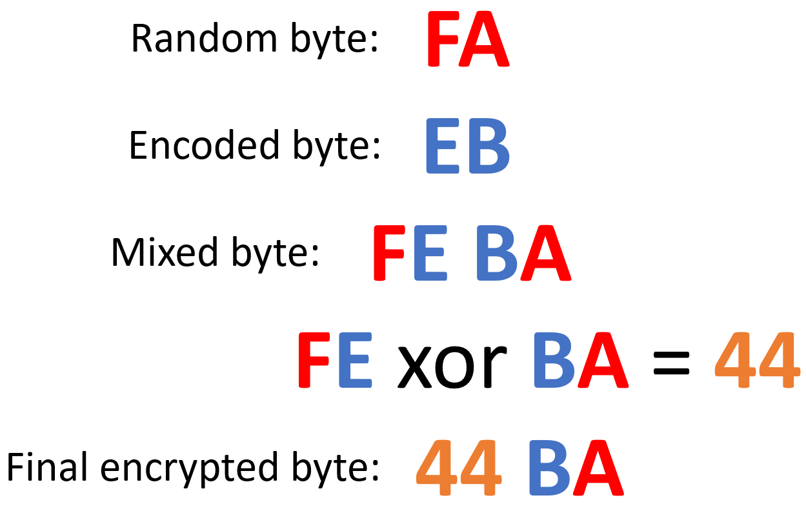
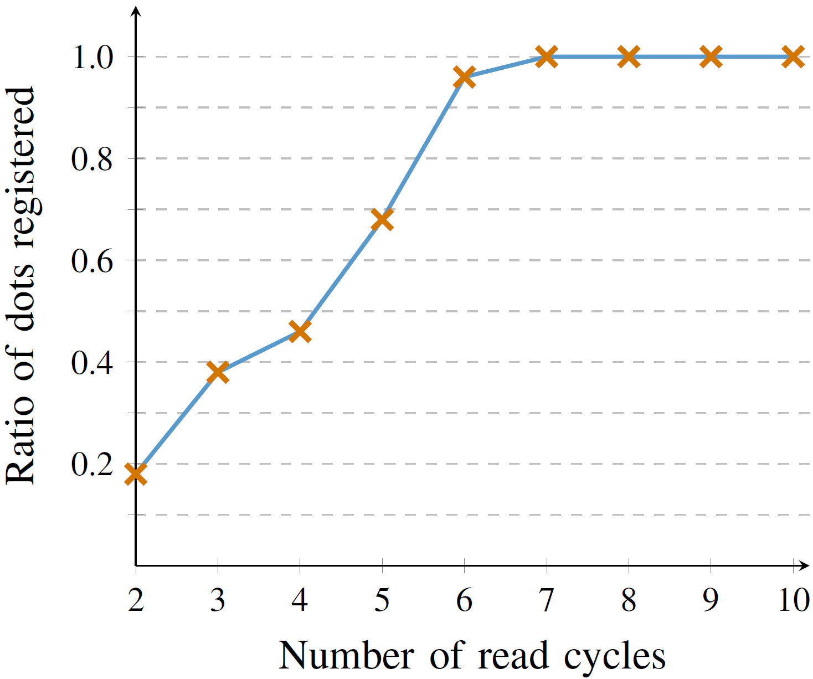
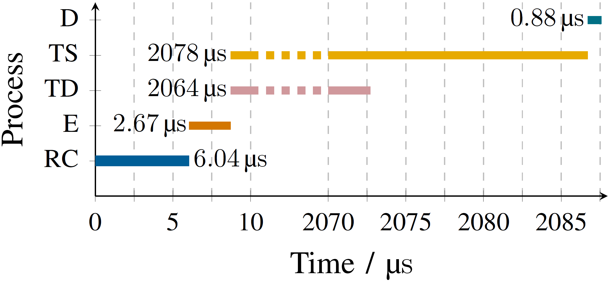

# Microprocessors
Repository for Physics Year 3 microprocessors lab

A simple assembly program for PIC18 microprocessor for communicating between two devices using morse code.

---

# Introduction
<!-- Provide an overview or background of the product. -->
IN the 1830s, Samuel Morse devised Morse code [1], assigning sequences of dots (•) or dashes (-) (see Table 1).
Morse code has historically played a crucial role in military, maritime, and aviation  communication until the mid-20th century and still retains its importance in scenarios where conventional communication infrastructures are unreliable. Encryption is a critical process in safeguarding data [3]. One common encryption technique involves the use of ‘exclusive or’ (XOR) - a logical operation that outputs 1 when comparing two differing bits (for example, 1 XOR 0 = 1 and 1 XOR 1 = 0) [4]. The data byte is encrypted by performing an XOR with a key byte. The XOR operation is reversible — therefore applying the same key a second time will decrypt the data. The project modernises Morse code through a PIC microcontroller-based translator. This device captures button inputs, converts them to binary, encrypts the data, and then communicates it to another microcontroller via UART. There, it’s decrypted, decoded, and displayed on an LCD. 

**Table 1: Morse Code Reference**
| Char | Morse | Char | Morse | Char | Morse  |
|-----:|:-----:|-----:|:-----:|-----:|:------:|
| **A** | `.-`    | **N** | `-.`    | **0** | `-----`  |
| **B** | `-...`  | **O** | `---`   | **1** | `.----`  |
| **C** | `-.-.`  | **P** | `.--.`  | **2** | `..---`  |
| **D** | `-..`   | **Q** | `--.-`  | **3** | `...--`  |
| **E** | `.`     | **R** | `.-.`   | **4** | `....-`  |
| **F** | `..-.`  | **S** | `...`   | **5** | `.....`  |
| **G** | `--.`   | **T** | `-`     | **6** | `-....`  |
| **H** | `....`  | **U** | `..-`   | **7** | `--...`  |
| **I** | `..`    | **V** | `...-`  | **8** | `---..`  |
| **J** | `.---`  | **W** | `.--`   | **9** | `----.`  |
| **K** | `-.-`   | **X** | `-..-`  | **?** | `..--..` |
| **L** | `.-..`  | **Y** | `-.--`  | **!** | `-.-.--` |
| **M** | `--`    | **Z** | `--..`  | **/** | `-..-.`  |
| **,** | `--..--`| **+** | `.-.-.` |      |          |

---

# Product Design

## High Level Design

<figure>
  
  <figcaption>Figure 1: Block diagram of Morse Communication Device, showing complexity gradient from left to right and temporal progression from top to bottom. Coloured outlines indicate  various modules’ files. The diagram includes the main loop (dashed box) for repetitive execution
and the interrupt service routine (ISR) for UART Rx interrupts (dotted box).</figcaption>
</figure>

The block diagram from Fig. 1 details the architecture of the Morse Communication Device: the process starts with input acquisition through a debouncing cycle that counters any mechanical noise. Auditory feedback is given when inputs trigger a sound. The core operation is the main loop, which processes and encodes inputs into Morse code, then encrypts and sends them. Encryption employs a random filler byte and an encryption key for greater security. The simplest algorithm to generate a pseudorandom number is the Linear Congruential Generator (LCG) [5], which is defined by the equation:

$$
X_{\mathrm{new}} = (a X_{\mathrm{old}} + c)\ (\text{mod } m)
$$

where *X* are the random numbers, *a* is the multiplier, *c* is the increment, and *m* is the modulo. This is an adjusted version for the device, the original equation is a recurrence relation. UART then transmits the encrypted data, and triggers an interrupt service routine (ISR) when received. The ISR decrypts data back to its original state before decoding it into alphanumeric characters for display on an LCD for a clear text readout.

## Hardware

<figure>
  
  <figcaption>Figure 2: Schematics of the components of one station. The secondary station is identical and is also connected to the switch hub. Direction of arrows represent flow of data.  Port pins are abbreviated: ’Port B pin 6’ to ’RB6 ’.</figcaption>
</figure>

The following components are in the device:

##### – EasyPIC Pro v7 kit

The board is a versatile development board equipped with a built-in programmer and debugger, ideal for prototyping Microchip PIC microcontroller applications. It supports various PIC models with its multi-socket design and is equipped with numerous onboard modules for real-world interfacing, namely the EUSART and piezo buzzer [6]. The EUSART’s USB UART module is used to simultaneously transfer (through Tx channel) and receive (through Rx channel) data.

##### – PIC18F87K22 Microcontroller

The PIC18F87K22 features a 64 MHz 8-bit core, 128 KB flash memory, and 3.9 KB RAM, enabling quick processing and real-time performance for Morse code communication. It has up to 35 I/O pins to connect the buttons, buzzers, and LCD displays, as shown in Fig. 2 [7]. 64MHz clock speed means that one instruction cycle (4 clock cycles) takes 62.9*ns*.

##### – LCD 16x2 screen (ST7066U)

As shown in Fig. 2 a 16x2 LCD screen is employed for the visual feedback screen mentioned in Fig. 1. The LCD utilises a controller which decodes the given instruction bytes and changes the display accordingly [8]. This also means that a slight delay is required after every instruction sent (time depends on the instruction) in order for the LCD’s controller to execute the command.

##### – Piezo buzzer

As shown in Fig. 2, a piezo buzzer is used for sound cues corresponding to the inputs of the user. This is a component on board the EasyPIC kit, which is directed to RB6 [6]. It sounds when a pulse width signal runs through the pin. The Capture/Compare/PWM 8 module was configured to be a pulse-width modulation (PWM) signal, set to output to RE4. This was wired to RB6 to trigger the piezo buzzer.

##### – Tactile button

A simple tactile button is incorporated as the primary input device. To mitigate any input inconsistencies such as switch bouncing, software debouncing techniques are implemented within the microcontroller’s firmware. Button bounce is a common problem where a single button press causes multiple rapid signals due to the mechanical contacts jittering, leading to additional erroneous inputs - this is resolved using debouncing techniques [9].

##### – Computer

Only used as a switch to connect two USB ports to each other. It has the capability to connect multiple ports to each other. Both devices were connected to the computer using a USB B to USB A cable.

## Software

Assembly language was used, a low-level language that closely interfaces with the microcontroller’s machine code: the code is compiled to translate assembly into executable instructions [10]. Assembly instructions, such as CLEAR to set a memory address to 0, or INCREMENT to add 1 to a value, map directly to single CPU operations. Variables are defined by allocating and labelling specific memory addresses to store data values. Additionally used are hexadecimal notation — a base-16 system using symbols 0-9 and A-F (represents denary values from 0 to 15). It efficiently represents binary data; for instance, binary ’0110 1011’ becomes ’6Bh’ in hex.

<figure>
  
  <figcaption>Figure 3: Flowchart of the main loop. There is no end point: the
program will run until the device is powered off. The read cycle will
return a value greater than 00h if the button is pressed and 00h if the
button is not pressed.</figcaption>
</figure>

### Setup

Sets up the peripherals’ and modules’ registers and pins’ tristates. Sets UART rate of signal changes (baud rate) to 9600, sets up UART Rx interrupt and sets the PWM signal to run at a frequency of 2.44*kHz*.

### Read cycles

Debouncing was addressed through read cycles: a defined loop consistently monitors the button’s state, discerning whether it is pressed (1) or not (0). It performs an inclusive or (IOR) operation with the prior state and records the outcome as the new state. As shown in Fig. 3, the interpretation of dots, dashes, or the start of a new character depends on the count of consecutive pressed read cycles (`press`) and not pressed read cycles (`pause`).

### Encoding to binary

Dots and dashes will be translated into 0s and 1s and stored in a byte. However, ’E’ (•) and ’I’ (• •), for example, would initially be encoded as `0000 0000`, with unused bits set to 0. To differentiate, an identifier bit marks the end of character inputs, making the encoded byte for ’E’ be `0000 0010` and ’I’ be `0000 0100`. This identifier bit is added when the pause determines that new character inputs will be entered.

### Encryption

To enhance data encryption unpredictability, the `encrypt byte` in Fig. 3 subroutine adds a random byte to the encoded byte. The LCG generates a random number using the variability of human input for dots and dashes. Incrementing the *c* constant by `press` after each input deviates from any pseudorandom sequence. The constant *m* is assigned a value of 255 for simplicity, aligning with the maximum byte value. 

<figure>
  
  <figcaption>Figure 4: Encryption process of a randomly generated byte [FA] and an encoded byte [EB].</figcaption>
</figure>

As shown in Fig. 4, the encoded byte is combined with the random byte to generate an encrypted word (two bytes). The lower and higher nibbles of the random byte are isolated and stored as the lower and upper parts of the encrypted byte, respectively. The encoded byte is then split into two halves and are subsequently added to the corresponding upper and lower parts of the encrypted bytes. Finally, the upper and lower parts of the encrypted byte undergo XOR with each other, and the result replaces the higher byte of the encrypted word (refer to `encryption.s`). This way each nibble of the encoded byte undergoes XOR with a randomly generated nibble. The word is then sent to the switch hub via the UART.

### Receiving bytes

<figure>
  
  <figcaption>Figure 5: Flowchart of the ISR. RCREG1 is the address the UART
module saves any received bytes to.</figcaption>
</figure>

The Interrupt Service Routine (ISR) in Fig. 5 begins by checking if a byte has already been received or not (using byte counter). If it has, then the contents of the RCREG1 register is moved to the higher byte or otherwise to the lower byte. Once both bytes are received, they are decoded, and the respective ASCII value is sent to the LCD display before ending the interrupt service routine.

---

# Product Modifications

The software and hardware was amended for better usability and efficiency.

## Software Updates

### Connecting sequence

Upon setup completion from Fig. 3, the startup routine initiates device connection and encryption key exchange.

**Stage 1:** The device broadcasts a search signal and increments a counter for random byte creation.

**Stage 2:** Upon detecting a search signal, sends a confirmation byte and pauses for a counter-determined random interval to prevent simultaneous confirmations.

**Stage 3:** Another random delay, it generates and sends a new random byte as the encryption key.

**Stage 4:** Another random delay, followed by generating a byte for *a* in the LCG equation.

### Adding space

For better legibility of messages, an input for space was added: it is simply a dash that is 20 cycles long. Before checking if the `press` is a dot or a dash in Fig. 3, it will now check if it is long enough for a space first. If so then the encoded byte will be set to FFh, encrypted and sent via UART; otherwise it will move onto check for a dot or dash. The decode sequence will know to move the cursor by 1 position if the decoded byte is FFh, hence making a space between two characters.

### Alternate ISR

Ideal ISRs should be shorter, therefore, the decode sequence (Decode bytes subroutine and onwards from Fig. 5) is moved to the main loop in Fig. 3. The main loop now, before looping back to reading the input, checks if both `higher byte` and `lower byte` are filled and then executes the decode sequence.

## Hardware Modifications

Running a signal through a switch will take longer than directly connecting two devices together, and this difference was tested. Since USB B cables do not have the Tx and Rx channels crossed over, the RC6 and RC7 of the devices were crossed over and connected to each other (direct connection). Although this limits a device to only communicate with one other device, this may significantly increase the transmission speed.

---

# Performance

## Button bouncing

In the performance analysis of the button debouncing time, multiple measurements indicated a mean bouncing time of 1.350*μs*, with a standard deviation of 0.724*μs*. The longest observed bouncing time in the dataset was 3.970*μs*. To accommodate occasional outliers and ensure robust performance, the debouncing time was set to 6*μs*. This duration is significantly beyond the maximum observed time, with a virtually negligible probability (in the order of -11, assuming that the bouncing times are normally distributed around the calculated mean) of any bouncing exceeding this threshold, thus providing a high degree of certainty that all bouncing effects will be adequately mitigated.

## Dash cycle length

<figure>
  
  <figcaption>Figure 6: Plot of the ratio of correctly registered dots against minimum number of read cycles for a dash. Sharp increase in ratio as the number of read cycles increased.</figcaption>
</figure>

In determining the minimum dash length during testing, the data focused on the least number of read cycles required for a dot to be reliably distinguished from a dash. The experiment entailed pressing a button 50 times, and recording how many of those presses were registered as dots. Fig. 6 shows that all presses were correctly identified as dots from 7 cycles onward. Despite this, a conservative threshold of 8 read cycles was selected to define a dash.

## Latency of processes

The latency of each process was measured by triggering RJ1 when the process is being executed. An oscilloscope was then used to capture the signal progression through RJ1 and calculate how long the signal is high for.

<figure>
  
  <figcaption>Figure 7: Timeline of each process in operational order: read cycle (RC), encoding and encryption (E), transmission (direct: TD, via switch: TS), then decryption and decoding (D). Timings for each process are next their respective bars. Both methods of transmissions are orders greater so only the beginning and end are shown. The resolution error of the oscilloscope are 4 orders smaller so uncertainties are not visible.</figcaption>
</figure>

As shown in Fig. 7, the transfer time (cumulative time from encryption to decoding) is 2.081*ms* for transmission through the switch and 2.067*ms* for direct connection. The greater part of the latency comes from the transmission of the data between the devices. There is only a 0.67% reduction in using directly crossed over wires instead of passing the data through the switch hub. In terms of speed against capability, using the switch is much better than direct connection because it has the capability of connecting to more devices at the cost of 14*μs*, which is unnoticeable.

## Operational bugs

During the connection sequence, an intermittent bug was encountered where one device would fail to progress beyond the 2nd stage, and the other device stuck in the 3rd stage. This rare issue, observed only three times, might stem from the Rx interrupt during UART data transmission. If a device does not advance from stage 2 or 3 within the expected transmission time, simply resetting the devices will solve the problem.

---

# Product Improvements

There are multiple features undeveloped due to time restrictions:

### Calibration

Adjust the minimum dash and space read cycles to be user-specific. By prompting the user to input a string of dots, dashes and spaces, the minimum cycle length for each can be found. The result can be saved in the EEPROM (non-volatile storage) and the reset button and the tactile button can be pressed simultaneously for recalibration.

### Form factor

Since the device does not require large nor many components, a smaller board with the necessary  components could have been developed.

### Multi-channel tactile button

Since the button only had two channels, it can only be used for connecting one circuit (since the second is always used for ground), therefore a software trigger is used to start the buzzer. Using a button with more channels can change the buzzer trigger to be hardware dependant (channel connects RE4 to RB6), and reduce number of instruction cycles needed per loop.

### Wireless transmission

Using a Wi-Fi adaptor and driver to connect to a router and transmit bytes through the internet will increase the portability and mobility of the device, albeit increasing the latency. For accessibility across various situations, both UART and Wi-Fi should be available on the

---

# References

1. T. E. of Encyclopedia, “Morse code.” [https://www.britannica.com/topic/Morse-Code](https://www.britannica.com/topic/Morse-Code), 2023.

2. “Learn morse code with this morse translator and decoder.”  
   [https://scoutlife.org/hobbies-projects/funstuff/575/morse-code-translator/](https://scoutlife.org/hobbies-projects/funstuff/575/morse-code-translator/), 2023.

3. R. F. Churchhouse, *Codes and ciphers: Julius Caesar, the enigma, and the internet.*  
   Cambridge, England: Cambridge University Press, 2001.

4. S. K. Garg, “Cryptography using xor cipher,” *Res. J. Sci. Technol.*, vol. 9, no. 1, p. 25, 2017.

5. “ACM transactions on mathematical software,” Aug. 2007.

6. “Easypic pro v7 manual.”  
   [https://cdn.mikroe.com/product/easyPIC%20PRO%20v7a/EasyPIC.PRO.v7.a.v101.manual-web.pdf](https://cdn.mikroe.com/product/easyPIC%20PRO%20v7a/EasyPIC.PRO.v7.a.v101.manual-web.pdf), 2021.

7. *PIC18F87K22 Family Data Sheet.* U.S.A: Microchip Technology Inc., 2011.

8. “Sitronix st7066u datasheet.”  
   [https://newhavendisplay.com/content/app%20notes/ST7066U.pdf](https://newhavendisplay.com/content/app%20notes/ST7066U.pdf), 2000.

9. FastBitLab, “Fsm lecture 29 - button bouncing explanation.”  
    [https://fastbitlab.com/fsm-lecture-29-button-bouncing-explanation/](https://fastbitlab.com/fsm-lecture-29-button-bouncing-explanation/), 2022.

10. J. Duntemann, *Assembly language step-by-step: Programming with DOS and Linux.*  
    John Wiley & Sons, 2 ed., 2000.

11. M. Neil, “Microprocessor labs.”  
    [https://github.com/ImperialCollegeLondon/MicroprocessorsLab](https://github.com/ImperialCollegeLondon/MicroprocessorsLab), 2021.

